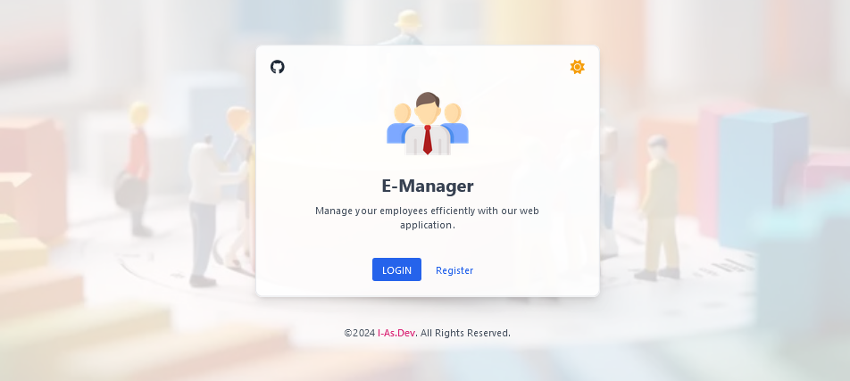

#  Aplikasi Web Employee Manager

Aplikasi web pengelolaan karyawan (**Employee Manager**) adalah solusi komprehensif yang dirancang untuk membantu organisasi dalam mengelola sumber daya manusia dengan lebih efisien. Dengan antarmuka yang intuitif dan fitur yang lengkap, aplikasi ini memungkinkan pengelolaan data karyawan, absensi, gaji, dan kinerja dalam satu platform yang terintegrasi.

## Fitur Utama

**1. Multi Role User** (status: ✔)

- Administrator seperti Mengelola seluruh data karyawan dan mengatur hak akses untuk pengguna lain.
- Manajer seperti Mengelola kinerja dan absensi karyawan di bawah divisi tertentu dan menyetujui permohonan cuti.
- Karyawan seperti Mengakses data pribadi seperti slip gaji, mengajukan permohonan cuti absensi dll.

**2. Manajemen Karyawan** (status: ❌)

- Penyimpanan Data Karyawan seperti Informasi dasar seperti nama, alamat, kontak, jabatan, dan riwayat pekerjaan.
- Dokumen Karyawan seperti Upload dan pengelolaan dokumen penting seperti KTP, NPWP, dan dokumen lainnya.
- Penambahan, pengeditan, dan penghapusan data karyawan.
- Pencarian dan filter untuk menemukan karyawan berdasarkan nama, jabatan, atau departemen.

**3. Pengelolaan Absensi** (status: ❌)

- Pencatatan kehadiran harian.
- Pengajuan dan persetujuan cuti.
- Laporan kehadiran karyawan.

**4. Penggajian** (status: ❌)

- Perhitungan Gaji seperti Menghitung gaji berdasarkan jam kerja, lembur, dan potongan yang berlaku.
- Slip Gaji Digital seperti Penyediaan slip gaji secara digital untuk karyawan.

**5. Komunikasi Internal** (status: ❌)

- Forum Diskusi seperti Tempat bagi karyawan untuk berdiskusi dan berbagi informasi.
- Pengumuman seperti Fitur untuk menyampaikan pengumuman penting dari manajemen.

**6. Penilaian Kinerja** (status: ❌)

- Penetapan dan pengukuran KPI (Key Performance Indicators) untuk karyawan.
- Penilaian kinerja secara berkala.

**7. Manajemen Proyek** (status: ❌)

- Pengelolaan Tugas seperti Fitur untuk membuat, menugaskan, dan memantau tugas dalam proyek.
- Waktu Penyelesaian seperti Mengelola status penyelesaian setiap tugas proyek.

**8. Laporan dan Analisis** (status: ❌)

- Laporan Kehadiran seperti Laporan terkait kehadiran dan ketidakhadiran karyawan.
- Laporan Kinerja seperti Analisis kinerja karyawan berdasarkan umpan balik dan penilaian.

**9. Manajemen Jabatan dan Departemen**  (status: ❌)

- Pengelolaan struktur organisasi, termasuk jabatan dan departemen.

| ✔  : Terselesaikan | ❌ : Belum Terselesaikan  |
| ------------------- | ------------------- |

## Tech Stack

- Nodejs
- Express
- Ejs
- MySQL
- Tailwind

 